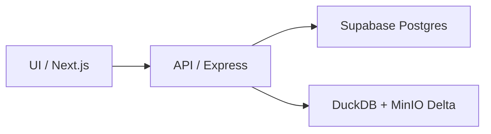

# Backend Objetivo - Supabase + DuckDB

## Idea central

La app ya tiene dos necesidades distintas:

1. `operacion transaccional`
   - usuarios
   - perfil
   - fincas
   - parcelas
   - campanas
   - watchlist
   - onboarding

2. `analitica y recomendaciones`
   - precios SISAP
   - exportaciones SUNAT
   - cuadros MIDAGRI
   - tendencias
   - riesgo
   - oportunidades

La arquitectura correcta es separar ambas.



## Que va en Supabase

### Tablas operativas
- `users`
- `profiles`
- `user_sessions`
- `farms`
- `parcels`
- `campaigns`
- `watchlist_items`
- `onboarding_events`

### Casos de uso
- registro
- login
- logout
- obtener perfil
- actualizar perfil
- registrar finca
- registrar parcela
- registrar campana
- guardar item en seguimiento

## Que se queda en DuckDB

### Fuentes
- `sunat`
- `sisap`
- `midagri_comercio_exterior`

### Casos de uso
- dashboard publico
- mercado publico
- tendencias de precios
- senales de cultivo
- planificador
- comparaciones de oportunidad

## Como deberia hablar el backend

### Modulos transaccionales nuevos
```text
api/src/
  application/
    auth/
    farms/
    campaigns/
    onboarding/
  domain/
    auth/
    farms/
    campaigns/
    onboarding/
  infrastructure/
    persistence/
      supabase/
        client/
        repositories/
      duckdb/
        clients/
        repositories/
```

### Regla de responsabilidad
- `supabase repositories`: escriben y leen datos operativos
- `duckdb repositories`: leen datos analiticos
- `use-cases`: cruzan ambos si hace falta

## Ejemplos de flujo

### Registro
`UI -> API -> auth controller -> register use-case -> supabase auth repository`

### Home nuevo usuario
`UI -> API -> onboarding controller -> onboarding use-case -> supabase profile/farm/campaign repositories`

### Home con datos reales
`UI -> API -> dashboard controller -> use-case`

Dentro del use-case:
- consulta Supabase para saber si el usuario tiene finca/campanas
- consulta DuckDB para traer senales publicas o personalizadas
- devuelve un response combinado

## Decision importante

El frontend no deberia conectarse directo a Supabase por ahora.

Mantener este flujo:
`UI -> API -> Supabase / DuckDB`

te da:
- control de permisos
- logica de negocio en un solo sitio
- menor acoplamiento
- posibilidad de cambiar auth luego sin romper UI

## Primer backlog recomendado

1. Crear schema en Supabase
2. Agregar cliente Postgres/Supabase en backend
3. Crear modulo `auth`
4. Crear modulo `farms`
5. Crear modulo `campaigns`
6. Crear modulo `onboarding`
7. Mantener `dashboard`, `marketplace`, `planner` leyendo DuckDB
