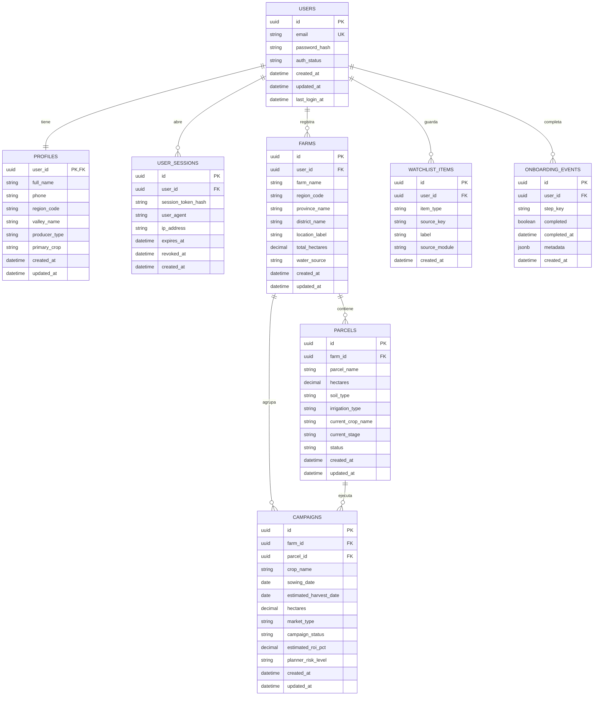

# ER Inicial - Supabase App Core

Este es el modelo base recomendado para la parte transaccional de AgroAnalitica:
- visitante con exploracion publica
- registro/login basico por email y password
- usuario nuevo sin finca ni campanas
- onboarding guiado
- datos operativos en Supabase Postgres
- analitica y senales en DuckDB

## Que resuelve este modelo

### 1. Visitante publico
No necesita fila en base de datos.
Puede ver:
- mercado
- precios de referencia
- cultivos con mejor senal
- tendencias publicas

### 2. Registro basico
Se crea:
- `users`
- `profiles`
- primera `user_sessions`

### 3. Usuario nuevo
Puede existir sin:
- `farms`
- `parcels`
- `campaigns`

Eso permite que el home no se vea vacio y el backend pueda responder:
- `is_new_user = true`
- `recommended_next_steps = [...]`

### 4. Usuario activo
Cuando registra:
- finca
- parcelas
- campanas

entonces el dashboard pasa a ser personalizado.

## Reglas de modelado

- `users` guarda solo lo minimo de autenticacion.
- `profiles` guarda metadata de negocio del productor.
- `farms` representa el predio o unidad productiva.
- `parcels` divide la finca en unidades manejables.
- `campaigns` guarda cada campana de siembra/produccion a lo largo del tiempo.
- `watchlist_items` sirve para seguir productos, compradores o referencias de mercado.
- `onboarding_events` evita meter estados raros en `users` y deja trazabilidad.

## Que no meter aqui

Estas cosas no deberian vivir en Supabase:
- caches analiticos de DuckDB
- tablas crudas de SUNAT
- tablas crudas de SISAP
- tablas crudas de MIDAGRI
- series pesadas de mercado historico

Eso debe seguir en DuckDB y MinIO.

## Separacion recomendada

- `Supabase Postgres`: operacion de la app
- `DuckDB`: analitica, tendencias y senales
- `API backend`: une ambos mundos
